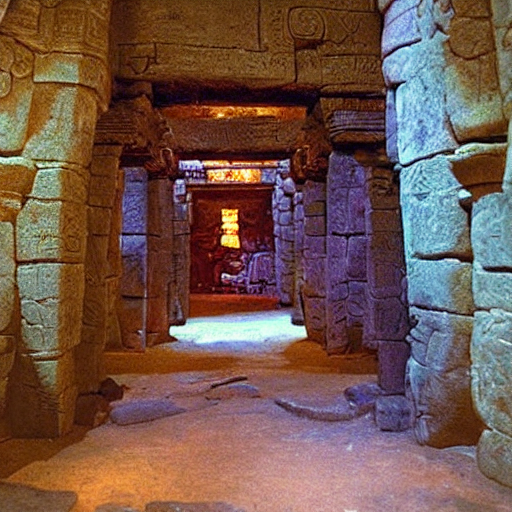

# 🏛️ Legends of the Hidden Temple - Terminal Game

A nostalgic recreation of the 90s Nickelodeon game show "Legends of the Hidden Temple" as an interactive terminal game with AI-generated room visuals.


*Example of an AI-generated temple room displayed in the terminal*

## 🎮 Game Overview

Race through Olmec's temple with only **3 minutes** on the clock! Navigate 24 interconnected rooms, dodge Temple Guards, find the Jade Serpent's Crown, and escape before time runs out. Win authentic 90s prizes like a trip to Space Camp!

### Features
- **24 Unique Temple Rooms**: From the Crypt of the Stone Monkey to the Heart Chamber
- **Real-Time Pressure**: 3-minute countdown timer (updates on each move)
- **Temple Guards**: Randomly placed guards that cost Pendants of Life
- **Visual Room Display**: AI-generated images shown in terminal using `chafa`
- **Authentic 90s Prizes**: Huffy bikes, Moon Shoes, British Knights sneakers, and more!
- **Multiple Paths**: Various routes through the temple maze
- **Olmec Narration**: Dramatic storytelling in the style of the original show

## 🚀 Quick Start

### Prerequisites
- Python 3.6+
- `chafa` for terminal image display (optional but recommended)
  ```bash
  # Ubuntu/Debian
  sudo apt install chafa
  
  # macOS
  brew install chafa
  
  # Arch Linux
  sudo pacman -S chafa
  ```

### Play the Game
```bash
# Clone the repository
git clone https://github.com/aaronsb/dungeon-generator.git
cd dungeon-generator

# Run the game
python3 temple_runner.py
# or
./temple_runner.py
```

## 🎨 Generating Temple Room Images

The game includes AI-generated images for each temple room. If you want to regenerate or customize the images:

### Requirements for Image Generation
- **Stable Diffusion WebUI** (Automatic1111) running locally
- API enabled on port 7860
- At least 4GB VRAM recommended

### Setup Stable Diffusion WebUI

1. **Install Stable Diffusion WebUI**:
   ```bash
   git clone https://github.com/AUTOMATIC1111/stable-diffusion-webui
   cd stable-diffusion-webui
   ```

2. **Launch with API enabled**:
   ```bash
   ./webui.sh --api --listen
   # or on Windows:
   webui.bat --api --listen
   ```

3. **Verify API is running**:
   - WebUI should be at: http://localhost:7860
   - API docs at: http://localhost:7860/docs

### Generate Images

Once Stable Diffusion is running with API enabled:

```bash
# Generate AI prompts from temple structure
./generate_room_prompts.py

# Generate images using Stable Diffusion API
./generate_temple_images.py
```

The image generator offers several options:
```
1. Generate ALL room images       # Create all 24 temple rooms
2. Generate missing rooms only    # Skip existing images
3. Regenerate specific room       # Replace a single room
4. Generate with custom settings  # Adjust steps, CFG scale, etc.
5. Check API status              # Verify SD connection
```

### Alternative Image Generation

If you don't have local Stable Diffusion, you can use the prompts from `temple-room-prompts.json` with:
- DALL-E 3
- Midjourney
- Leonardo AI
- Stable Diffusion online
- Any other image generation service

Save generated images with the exact filenames specified in the JSON (e.g., `temple_room_crypt.png`) in the `room_images/` directory.

## 📁 Project Structure

```
maze/
├── temple_runner.py              # Main game engine
├── temple-map-graph.json         # Temple room structure & connections
├── temple-prizes.json            # 90s prize database
├── temple-room-prompts.json      # AI image generation prompts
├── generate_room_prompts.py      # Creates prompts from temple structure
├── generate_temple_images.py     # Batch image generator via SD API
├── room_images/                  # Generated temple room images
│   ├── temple_room_entrance.png
│   ├── temple_room_crypt.png
│   └── ... (24 room images)
├── CLAUDE.md                     # Development documentation
└── README.md                     # This file
```

## 🎯 How to Play

1. **Start at the Temple Entrance** - You have 2 Pendants of Life
2. **Navigate rooms** - Choose numbered options to move between rooms
3. **Find the Crown** - Located in the Heart Chamber
4. **Return to Entrance** - Get back before time runs out!
5. **Avoid Temple Guards** - They cost 1 Pendant (lose all = game over)

### Controls
- Enter room number to move
- Ctrl+C to quit

### Tips
- Study the map - multiple paths exist
- Some rooms have one-way passages
- Guards are randomly placed each game
- Speed matters for better prizes!

## 🏆 Prize System

Performance determines your prize tier:

| Category | Examples |
|----------|----------|
| **Grand Prize** (Complete under 60s) | Trip to SPACE CAMP! |
| **Temple Games** (Complete temple) | Huffy bike, Sega Game Gear |
| **Round Prizes** (Good progress) | Moon Shoes, British Knights |
| **Participation** (Any attempt) | Nickelodeon T-shirt, Nestle Crunch |

## 🛠️ Technical Details

### Game Mechanics
- **Real-time timer**: Clock runs continuously, display updates on moves
- **Graph-based navigation**: JSON defines room connections
- **Dynamic guard placement**: 3 guards randomly positioned
- **Image display**: Uses `chafa` to render PNG images in terminal

### Image Generation Settings
- **Model**: Stable Diffusion 1.5 recommended
- **Size**: 768x512 pixels
- **Steps**: 30
- **CFG Scale**: 7.5
- **Sampler**: DPM++ 2M Karras
- **Style**: "Legends of the Hidden Temple TV show set, 90s Nickelodeon"

### Customization
- Edit `temple-map-graph.json` to modify room layout
- Update `temple-prizes.json` to change prizes
- Adjust timer in `temple_runner.py` (default: 180 seconds)
- Modify guard count (default: 3)

## 🐛 Troubleshooting

### "Temple run ended!" immediately
- Make sure you're running in an interactive terminal
- Try: `python3 -u temple_runner.py`

### Images not displaying
- Install `chafa`: `sudo apt install chafa`
- Verify images exist in `room_images/`
- Check image filenames match JSON

### Stable Diffusion API errors
- Ensure SD WebUI is running with `--api` flag
- Check port 7860 is accessible
- Verify model is SD 1.5 (not Hunyuan or others)

## 📝 Development

This project was developed as an educational tribute to the classic 90s game show. Feel free to:
- Add new rooms
- Create custom temple layouts
- Implement new game modes
- Add sound effects
- Create multiplayer support

## 🎉 Credits

- Based on "Legends of the Hidden Temple" © Nickelodeon/Viacom
- Created as an educational project
- Temple room images generated with Stable Diffusion
- Terminal image display via `chafa`

## 📜 License

This is a fan project for educational purposes. All rights to "Legends of the Hidden Temple" belong to their respective owners.

---

*The choices are yours and yours alone. Good luck!* - Olmec
